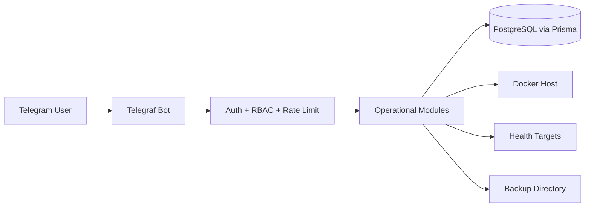

# TeleOps System Architecture

Updated: 2026-08-05

## Overview

TeleOps is a single NestJS application that exposes a Telegram-first operations surface for a VPS or host running Docker workloads. The app keeps risky mutations behind RBAC, persisted confirmation tokens, audit logging, and allowlist checks.

## Main Components

- `Telegram transport`: receives `/start`, `/cancel`, and callback queries through Telegraf.
- `Policy layer`: authorizes users, applies RBAC permissions, rate limits Telegram interactions, and requires confirmation for sensitive actions.
- `Operational modules`: Dashboard, Server, Docker, Deploy, Backup, Monitoring, Alerts, Users, Settings, and Audit.
- `Persistence`: Prisma stores users, action requests, audit logs, backups, deployments, monitoring samples, alert events, and runtime settings overrides.
- `Infrastructure adapters`: Dockerode for Docker, `pg_dump` for backups, `systeminformation` for host metrics, and HTTP probes for health checks.

## Runtime Flow

## Safety Boundaries

- Sensitive operations use `ActionRequest` records with actor-bound and time-bounded confirm/cancel tokens.
- Docker mutations are disabled by default and can only target allowlisted containers.
- Deployments are target-driven from validated YAML, not free-form Telegram input.
- Audit payloads redact sensitive keys before persistence.
- Telegram UI text is Vietnamese, while internal code identifiers stay English.
